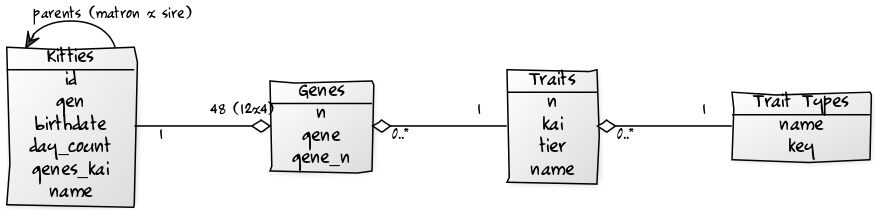

# Crypto Copycats Collectibles - Buy! Sell! Hodl! Sire!


## Copycats Database Tools

- [**copycats**](copycats) -  incl. `kitty` command line tool to (auto-)read kitty data records (in comma-separated values (CSV)) into an in-memory SQLite database
and print reports
- [**bitcat**](bitcat) - bit catalog kitty browser; browse your (digital) bit(s) collections


## Database Tables

Table Diagram




SQL Tables (in SQLite Dialect)

``` sql
CREATE TABLE kitties (
    id           INTEGER  PRIMARY KEY AUTOINCREMENT
                          NOT NULL,
    name         VARCHAR,
    genes_kai    VARCHAR  NOT NULL,
    gen          INTEGER  NOT NULL,
    birthdate    DATETIME NOT NULL,
    day_count    INTEGER  NOT NULL,
    matron_id    INTEGER,
    sire_id      INTEGER,
    body_id      INTEGER  NOT NULL,
    pattern_id   INTEGER  NOT NULL,
    coloreyes_id INTEGER  NOT NULL,
    eyes_id      INTEGER  NOT NULL,
    color1_id    INTEGER  NOT NULL,
    color2_id    INTEGER  NOT NULL,
    color3_id    INTEGER  NOT NULL,
    wild_id      INTEGER  NOT NULL,
    mouth_id     INTEGER  NOT NULL
);


CREATE TABLE genes (
    id       INTEGER PRIMARY KEY AUTOINCREMENT
                     NOT NULL,
    kitty_id INTEGER NOT NULL,
    n        INTEGER NOT NULL,
    gene     VARCHAR NOT NULL,
    gene_n   INTEGER NOT NULL,
    trait_id INTEGER NOT NULL
);


CREATE TABLE traits (
    id            INTEGER PRIMARY KEY AUTOINCREMENT
                          NOT NULL,
    trait_type_id INTEGER NOT NULL,
    name          VARCHAR NOT NULL,
    n             INTEGER NOT NULL,
    kai           VARCHAR NOT NULL,
    tier          INTEGER
);

CREATE TABLE trait_types (
    id    INTEGER PRIMARY KEY AUTOINCREMENT
                  NOT NULL,
    name  VARCHAR NOT NULL,
    [key] VARCHAR NOT NULL
);

```

## Database Setup

Use the kitty setup command to setup an SQLite database and (auto-)read
all datafiles. Example:

```
$ kitty setup
```

This will create:

- a single-file SQLite database `kitties.db`
- setup all tables
- add all known traits and trait types (body, pattern, eyes, ...) and
- (auto-)read all datafiles (`**/*.csv`) in the `.` and all subdirectories


Note: Use the `-i/--include` option to change the default data directory (that is, `.`)
and use the `-n/--dbname` option to change the default SQLite database name (that is, `kitties.db`)
and use the `-d/--dbpath` option to change the default SQLite database path (that is, `.`).


Showtime! Use the sqlite3 command line tool
and try some queries. Example:

```
$ sqlite3 kitties.db

sqlite> SELECT * FROM kitties WHERE id = 1;

1||ccac 7787 fa7f afaa 1646 7755 f9ee 4444 6766 7366 cccc eede|0|2017-11-23 06:19:59|...

sqlite> SELECT * FROM genes WHERE trait_id = 14;    -- sphynx (14)

1|1|0|d|0|14
3|1|2|r2|2|14
4|1|3|r3|3|14
38|2|1|r1|1|14
146|5|1|r1|1|14
181|6|0|d|0|14
183|6|2|r2|2|14
...
```


## Database Queries

### SQL

#### Find all kitties with a trait

Let's use the trait savannah (fur) with the id 0:

``` sql
SELECT id FROM kitties WHERE body_id = 0
```

#### Find all kitties with two traits

Let's use the trait savannah (fur) with the id 0
and the trait tiger (pattern) with the id 33:

``` sql
SELECT id FROM  kitties
          WHERE body_id = 0 AND pattern_id = 33
```


#### Find all kitties with a trait (in any gene d/r1/r2/r3)

Note: All traits (12 x 32 = 384) are numbered with ids from 0 to 383 in the traits database table.
Let's use the trait savannah (fur) with the id 0:

``` sql
SELECT kitty_id FROM genes WHERE trait_id = 0
```


#### Find all kitties with a dominant (visible) trait

Note: Use `gene` column (`d`/`r1`/`r2`/`r3`) or the numeric `gene_n`
column (0/1/2/3): Let's use the trait savannah (fur) with the id 0
and a dominant (d) gene:


``` sql
SELECT kitty_id FROM  genes
                WHERE trait_id = 0 AND gene='d'
```


#### Find all kitties with two traits (in any gene d/r1/r2/r3)

Use two query with "intersect" the result. Let's
use the trait savannah (fur) with the id 0
and the trait tiger (pattern) with the id 33:

``` sql
SELECT kitty_id FROM genes WHERE trait_id = 0
INTERSECT
SELECT kitty_id FROM genes WHERE trait_id = 33
```


### Using Models w/ ActiveRecord in Ruby


#### Find all kitties with a trait

Let's use the trait savannah (fur) with the id 0:

``` ruby
Kitty.find_by( body: Trait.find_by( name: 'savannah' ))
# -or -
Kitty.find_by( body_id: 0)
```

#### Find all kitties with two traits

Let's use the trait savannah (fur) with the id 0
and the trait tiger (pattern) with the id 33:

``` ruby
Kitty.find_by( body:    Trait.find_by( name: 'savannah' ),
               pattern: Trait.find_by( name: 'tiger' ))
# -or -
Kitty.find_by( body_id: 0, pattern_id: 33 )
```


#### Find all kitties with a trait (in any gene d/r1/r2/r3)

Let's use the trait savannah (fur) with the id 0:

``` ruby
genes = Gene.find_by( trait: Trait.find_by( name: 'savannah' ))  # query
#-or-
genes = Gene.find_by( trait_id: 0 )
genes.map { |gene| gene.kitty }                                  # get kitties (from gene)
```


#### Find all kitties with a dominant (visible) trait

Let's use the trait savannah (fur) with the id 0 and a dominant (d) gene:


``` ruby
genes = Gene.find_by( trait: Trait.find_by( name: 'savannah' ),
                      d:     'd' )                               #query
#-or-
genes = Gene.find_by( trait_id: 0, d: 'd' )
genes.map { |gene| gene.kitty }                                  # get kitties (from gene)
```


#### Find all kitties with two traits

Use two query with "intersect" the result. Let's
use the trait savannah (fur)
and the trait tiger (pattern):

``` ruby
genes = Gene.select('kitty_id').where( trait: Trait.find_by( name: 'savannah' )).intersect(
        Gene.select('kitty_id').where( trait: Trait.find_by( name: 'pattern' )))
genes.map { |gene| gene.kitty }     # get kitties (from gene)
```


## Datasets

[(Crypto) Kitties on the Blockchain](https://github.com/cryptocopycats/kitties) -
public dataset in comma-separated values (CSV) format in blocks of a thousand kitties each (e.g.
[`000.csv`](https://github.com/cryptocopycats/kitties/blob/master/1-99_999/000.csv) incl. 1-999,
[`001.csv`](https://github.com/cryptocopycats/kitties/blob/master/1-99_999/001.csv) incl. 1000-1999,
[`002.csv`](https://github.com/cryptocopycats/kitties/blob/master/1-99_999/002.csv) incl. 2000-2999,
and so on). The data records for kitties incl. id, gen(eration), matron+sire ids, birthdate, 48 (12x4) genes in kai (base32) notation, and more.

<!--
[(Crypto) Kittydex Kitty Data](https://cryptokittydex.com/resources) - public dataset in comma-separated values (CSV) format in a single file (+250 MiB).
The data records for kitties incl. id, gen(eration), matron+sire ids, birthdate, 48 (12x4) genes in kai (base32) notation, and more.
-->


Add your dataset here!


