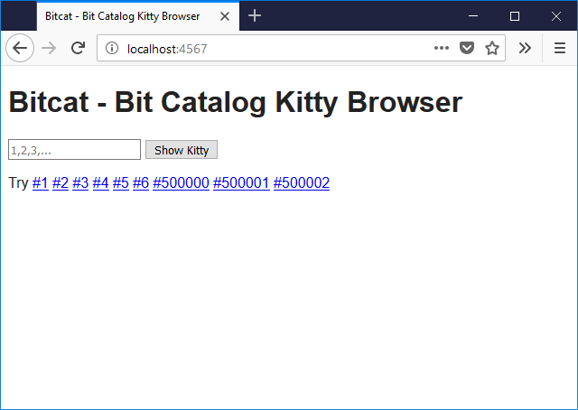

# bitcat - Bit Catalog Kitty Browser

browse your (digital) bit(s) collections -
browse your (crypto) kitties and more


* home  :: [github.com/openblockchains/bitcat](https://github.com/openblockchains/bitcat)
* bugs  :: [github.com/openblockchains/bitcat/issues](https://github.com/openblockchains/bitcat/issues)
* gem   :: [rubygems.org/gems/bitcat](https://rubygems.org/gems/bitcat)
* rdoc  :: [rubydoc.info/gems/bitcat](http://rubydoc.info/gems/bitcat)


## Usage


### Step 0 - Database Setup

Note: The bitcat server machinery requires a (local) single-file SQLite database,
that is, `kitties.db`, in your working folder.

See the [Copycats page on how to setup a (local) single-file SQLite database »](https://github.com/openblockchains/copycats#database-setup)


### Step 1 - Start the Bitcat Server

Start up the bitcat server on the command line:

    $ bitcat


### Step 3 - Open Bitcat Page in Browser

Open up the browser at `localhost:4567`.



That's it. Enjoy.


## Installation - I Can Has Bitcat?

Use:

```
$ gem install bitcat
```


## Questions? Comments?

Post them on the [cryptokitties reddit](https://www.reddit.com/r/cryptokitties). Thanks.


## License


The `bitcat` scripts are dedicated to the public domain.
Use it as you please with no restrictions whatsoever.
